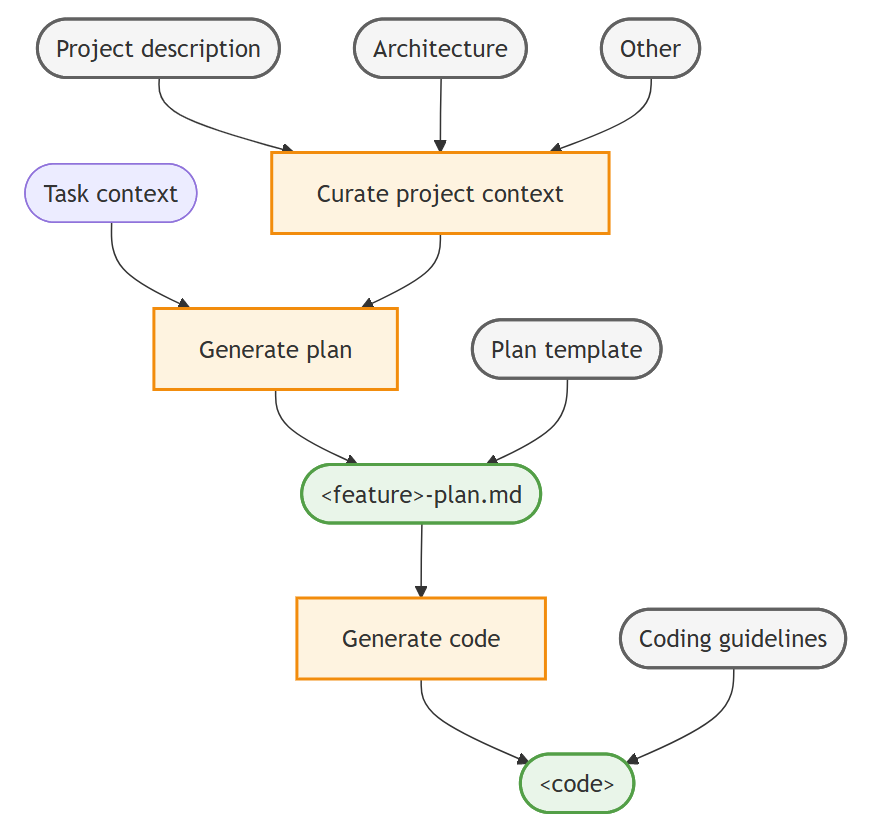

# Context engineering workflow
The high-level workflow for context engineering in VS Code consists of the following steps:

1. Curate project-wide context: use custom instructions to include relevant documentation (for example, architecture, design, contributor guidelines) as context to all agent interactions.
2. Generate implementation plan: create a planning persona by using a custom agent and a prompt to generate a detailed feature implementation plan.
3. Generate implementation code: use custom instructions to generate code based on the implementation plan that adheres to your coding guidelines.

As you work through the steps, you can iterate and refine the output with follow-up prompts in the chat.

The following diagram illustrates a context engineering workflow in VS Code:

